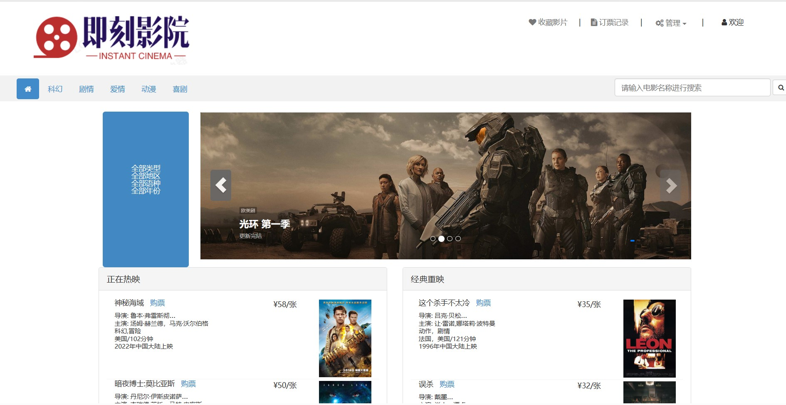
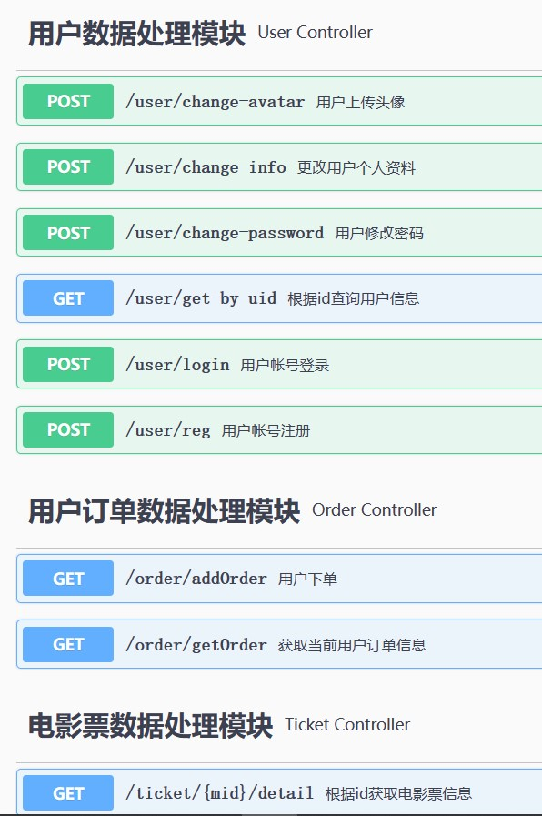

# movie

## 项目简介

项目简介:`movie`即刻影院-在线电影票预订系统,一个基于`Spring Boot + Mybatis`的简单项目，包含用户端和管理端，
主要功能包括用户个人资料与密码的修改，头像的上传，电影票浏览与购买，电影信息管理，用户订单管理等，为Java课程设计的作业。

### 界面展示
#### 用户登录

#### 主页

## 技术选型
### 后端技术

| 技术名称        | 技术官网                                           |
|-------------|------------------------------------------------|
| Spring Boot | https://spring.io/projects/spring-boot         |
| Spring MVC  | https://spring.io/projects/spring-mvc          |
| Mybatis     | http://www.mybatis.org/mybatis-3/zh/index.html |
| MySQL       | http://www.mysql.com                           |
| Swagger     | https://swagger.io/                            |

### 前端技术

| 技术名称       | 技术官网                                                            |
|------------|-----------------------------------------------------------------|
| HTML       | https://developer.mozilla.org/en-US/docs/Web/HTML               |
| CSS        | https://developer.mozilla.org/en-US/docs/Web/CSS                |
| JavaScript | https://developer.mozilla.org/en-US/docs/Web/JavaScript         |
| Bootstrap3 | https://getbootstrap.com/docs/3.4/getting-started/introduction/ |

### API 文档

### 更多功能待开发中

